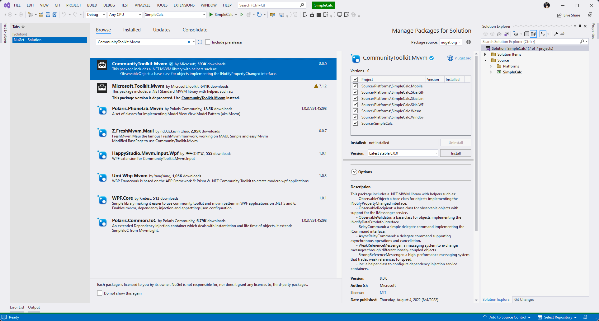
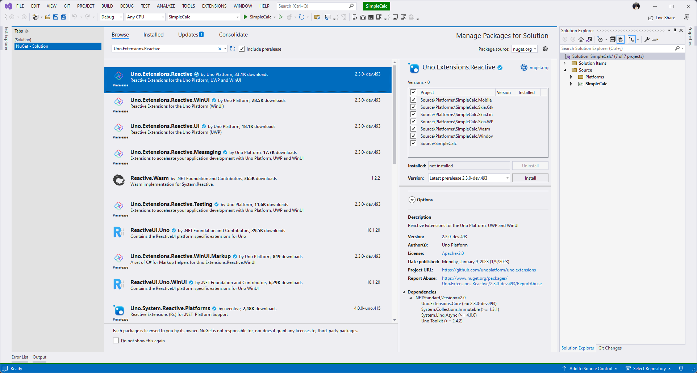

# Simple Calc Workshop

The Simple Calc Workshop is here to help you get started building an app for Desktop, Mobile and Web with Uno Platform. This workshop is designed to help you get your developer environment set up to start building your first Uno App while learning about the tools, libraries and patterns that will help you to build your apps with Uno Platform.

## What you will learn

- How to prepare your environment to build cross platform apps with Uno Platform whether you're using Visual Studio, Visual Studio for Mac, or Visual Studio Code.
- How to create a new solution using the Uno Platform templates.
- What the Uno Toolkit offers and how it can help you build pixel perfect apps cross platform
- How to get started with the Uno Themes for Fluent, Material or Cupertino
- How to build your app using XAML
- How to build your app using Model-View-ViewModel (MVVM) or Model-View-Update for XAML (MVU-X)

## Prerequisites

- A working understanding of C# / .NET
- Visual Studio 2022 (Windows or Mac)
- Visual Studio Code (optional)

### Good to have

- A working understanding of XAML
- A working understanding of MVVM

## Modules

- [01 - Getting Started](#1-getting-Started)
- [02 - Creating the Project](#2-creating-the-project)
- [03 - Basic Layout](#3-basic-layout)
- [04 - Architecture](#4-architecture)
  - [MVVM](modules/04-App%20Architecture%20-%20MVVM/README.md)
  - [MVU-X](modules/04-App%20Architecture%20-%20MVU-X/README.md)

# 1. Getting Started

Uno Platform provides a cross platform solution for building native apps for iOS, Android, Windows, macOS, WebAssembly as well as Linux FrameBuffer and GTK. This module will walk you through the process of getting started with Uno Platform.

## Pre-requisites

You should already have a working understanding of C# with one of the following IDEs:

- Visual Studio 2022 (Windows or Mac)
- Visual Studio Code
- JetBrains Rider

## Setting up the Environment

If you are using Visual Studio, depending on the workloads that you have installed your environment may already be ready to go. As a best practice or to help solve issues following Visual Studio updates, we recommend that you run the Uno Check tool to ensure that your environment is ready to go. From the Terminal

```bash
dotnet tool install --global Uno.Check
```

If you previously installed Uno.Check, make sure it is up to date with:

```bash
dotnet tool update --global Uno.Check
```

When ready, run the tool with:

```
uno-check
```

On a mac, you may need to run the command this way:

```
~/.dotnet/tools/uno-check
```

> **NOTE:** You may need to take additional steps if trying to build the Linux or GTK heads on Windows. Be sure to follow the [Additional setup for Linux or WSL](https://platform.uno/docs/articles/get-started-with-linux.html?tabs=ubuntu1804) docs.

# 2. Creating the Project

## Getting the Project Templates

Uno Platform provides a robust template system that allows you to create projects with the features that you need. To get started we will continue from the Terminal and install the Uno Platform Extensions Template.

```bash
dotnet new install Uno.Extensions.Templates::2.3.0-dev.572
```

> **NOTE**: We are installing the preview version currently, soon 2.3 will be released as stable.

Now that we have the template installed let's take a look at the options before we create a project.

```bash
dotnet new unoapp-extensions -h
```

## Building your first project

Before we build our first app it's important to make a few decisions about how we would like to build our app. The template that we installed in the first module gives us a lot of options but we're just going to focus on a few to start.

## What is XAML

XAML is a XML based markup language that is used to define the structure of a user interface. First introduced by Microsoft for WPF applications, this has been a proven solution for building user interfaces. XAML is a declarative language, meaning that it describes the structure of the UI, but not how it should be rendered. This is done by the XAML processor, which is the XAML engine in the .NET framework. Due to it's nature, XAML is often preferred by developers coming from a web background as it is similar to HTML. However, XAML is not a replacement for HTML, and is not intended to be used for web development. It is important to understand that individual nodes in XAML map to actual .NET objects, and that the XAML processor is responsible for creating these objects and setting their properties.

## Using Uno Platform app templates

For this project we will be using the `unoapp-extensions` Template. As this template by default includes a number of features we don't need for this project we will be specifying some options to exclude them (`-di false -server false -unit-tests false -ui-tests false`). These options will disable all of the Uno Extensions which require dependency injection, as well as create the project without the Server (API) project and the Unit and UI Tests. We will also be specifying the `-id` option to set the Package Identifier for the project. This is important as it will be used to identify the app in the app store and is used to identify the app when installing it on a device. Be sure to update `com.yourcompany.simplecalculator` to a unique identifier for your company.

By default the project will be created with XAML. If you would like to use the MVVM pattern you can specify the `-presentation mvvm` option.

```bash
# If using the MVVM module
dotnet new unoapp-extensions -presentation mvvm -di false -server false -unit-tests false -ui-tests false -id com.yourcompany.simplecalculator -o SimpleCalculator

# If using the MVU-X module
dotnet new unoapp-extensions -presentation mvux -di false -server false -unit-tests false -ui-tests false -id com.yourcompany.simplecalculator -o SimpleCalculator
```

# 3. Basic Layout

Start by opening `SimpleCalculator.sln` in Visual Studio or opening the root folder in Visual Studio Code.

The generated project is a plain and simple application. Before you run it for the first time, please comment out the following line in `AppStart.cs`:

```csharp
//if (args.UWPLaunchActivatedEventArgs.PrelaunchActivated == false)
```

This is currently causing issues on Windows and will be fixed in the stable templates.

Now we should be able to run the app on Windows, or any other target. We should be greeted with a simple Hello message.

## Adding resources

Our UI will use two path-based icons. These are prepared in a XAML resource dictionary in the `resources` folder. Copy the `Icons.xaml` file in the `Styles` folder under `SimpleCalculator` project. Then open `App.xaml` file under any of the platform projects and add a reference to this `ResourceDictionary`:

```xml
<ResourceDictionary.MergedDictionaries>
  ...

  <ResourceDictionary 
    Source="ms-appx:///SimpleCalculator/Styles/Icons.xaml" />

</ResourceDictionary.MergedDictionaries>
```

## Uno Toolkit

The Uno Toolkit provides a number of controls and attached properties that help us build pixel perfect apps. For the purposes of the Simple Calc we will be looking at 2 primary things from the Toolkit. For more information on the Toolkit be sure to check out the [Toolkit docs](https://platform.uno/docs/articles/external/uno.toolkit.ui/doc/getting-started.html)

### Installing the Toolkit

Because we used the Uno Platform Extensions template to create the project, we already have the `Uno.Toolkit.WinUI` package installed. If you started a plain project, you can install it manually. Visual Studio or Visual Studio for Mac open the Package Manager and locate the package listed for either XAML. For those developing from Visual Studio Code please click on the link for the package to determine the latest available package and add the PackageReference to the SimpleCalc.csproj

Install [Uno.Toolkit.WinUI](https://www.nuget.org/packages/Uno.Toolkit.WinUI/)

<picture>
  <source media="(prefers-color-scheme: dark)" srcset="art/Dark/UnoToolkitWinUI.png">
  <source media="(prefers-color-scheme: light)" srcset="art/Light/UnoToolkitWinUI.png">
  
</picture>

Next, verify the `Uno.Toolkit.UI` resources are referenced in `App.xaml`:

```xml
<Application x:Class="SimpleCalculator.App"
			 xmlns="http://schemas.microsoft.com/winfx/2006/xaml/presentation"
			 xmlns:x="http://schemas.microsoft.com/winfx/2006/xaml"
			 xmlns:wasm="http://platform.uno/wasm"
			 xmlns:local="using:SimpleCalculator"
			 xmlns:mc="http://schemas.openxmlformats.org/markup-compatibility/2006"
			 mc:Ignorable="wasm">

	<Application.Resources>
		<ResourceDictionary>
			<ResourceDictionary.MergedDictionaries>
				<!-- Load WinUI resources -->
				<XamlControlsResources xmlns="using:Microsoft.UI.Xaml.Controls" />

				<!-- Load Uno Toolkit resources -->
				<ToolkitResources xmlns="using:Uno.Toolkit.UI" />

				...
			</ResourceDictionary.MergedDictionaries>
			<!-- Add resources here -->
		</ResourceDictionary>
	</Application.Resources>

</Application>
```

## AutoLayout

For developers coming from other platforms it is easiest to think of the AutoLayout like a Flex Layout that you may be familiar with in web development or other UI Frameworks. For more information about the AutoLayout be sure to check out the [docs](https://platform.uno/docs/articles/external/uno.toolkit.ui/doc/controls/AutoLayoutControl.html).

For our layout we will start by adding an AutoLayout as the root which will contain our UI. Next we will add a ToggleButton centered at the top of our layout and two more AutoLayouts which we will later update to contain the Display and the Buttons for our Calculator.

```xml
<Page x:Class="SimpleCalculator.MainPage"
      xmlns="http://schemas.microsoft.com/winfx/2006/xaml/presentation"
      xmlns:x="http://schemas.microsoft.com/winfx/2006/xaml"
      xmlns:utu="using:Uno.Toolkit.UI">
  <utu:AutoLayout MaxWidth="700"
                  Padding="0,0,0,16"
                  PrimaryAxisAlignment="End">
    <ToggleButton Margin="8"
                  utu:AutoLayout.CounterAlignment="Center"
                  CornerRadius="20">
      <ToggleButton.Content>
        <PathIcon Data="{StaticResource SunIcon}" />
      </ToggleButton.Content>
    </ToggleButton>
    <utu:AutoLayout Spacing="16" Padding="16,8" PrimaryAxisAlignment="End" utu:AutoLayout.PrimaryAlignment="Stretch">
        <TextBlock Text="Equation"
                   utu:AutoLayout.CounterAlignment="End" />
        <TextBlock Text="Output"
                   utu:AutoLayout.CounterAlignment="End" />
    </utu:AutoLayout>
    <utu:AutoLayout MaxHeight="500" Spacing="16" Padding="16,0">
      <TextBox Text="Some Text"
               utu:AutoLayout.CounterAlignment="Stretch"/>
      <Button Content="Press Me"
              utu:AutoLayout.CounterAlignment="Stretch" />
    </utu:AutoLayout>
  </utu:AutoLayout>
</Page>
```

Now that you have basic Layout, run the app and take a look at how it looks. Depending on whether you are on PC or Mac try out some of the various targets available to you.

## Safe Area

Safe Area is a concept that is used to ensure that the UI is not covered by the device's status bar or navigation bar (or notch). For more information about the SafeArea be sure to check out the [docs](https://platform.uno/docs/articles/external/uno.toolkit.ui/doc/controls/SafeArea.html).

In order to make use of the SafeArea we need to update the root AutoLayout by using the `Insets` attached property set to `VisibleBounds`


```xml
<Page x:Class="SimpleCalculator.MainPage"
      xmlns="http://schemas.microsoft.com/winfx/2006/xaml/presentation"
      xmlns:x="http://schemas.microsoft.com/winfx/2006/xaml"
      xmlns:utu="using:Uno.Toolkit.UI">
  <utu:AutoLayout utu:SafeArea.Insets="VisibleBounds"
                  MaxWidth="700"
                  Padding="0,0,0,16"
                  PrimaryAxisAlignment="End">
    <!-- Your Content -->
  </utu:AutoLayout>
</Page>
```

# 3. App Architecture

In this section we will add a application design architecture - either MVVM or MVU-X. Follow the section that matches your selection from `dotnet new`.

For both MVVM and MVU-X we will need to add the `AppThemeService.cs` file from `references` to the `SimpleCalculator` project. This service needs to be initialized for the current window. We can do so in `AppStart.cs` right after the window is created:

``` c#
#if NET6_0_OR_GREATER && WINDOWS && !HAS_UNO
		Window = new Window();
		Window.Activate();
#else
		Window = Microsoft.UI.Xaml.Window.Current;
#endif

AppThemeService.Init(Window);
```

# 3a. Model View ViewModel (MVVM)

Model-View-ViewModel is a well established pattern for building applications. It is a pattern that is well suited to the Uno Platform, and is a great way to build your apps. In this module we will be looking at how to use the MVVM pattern to build our UI. We will be using the CommunityToolkit.MVVM to help us build our UI. It is important to note that while we will be using the CommunityToolkit that there are a number of other MVVM Frameworks that you can use with Uno Platform.


Because we used the Uno Platform Extensions template to create the project, we already have the `CommunityToolkit.Mvvm` package installed. If you started a plain project, you can install it manually.

<picture>
  <source media="(prefers-color-scheme: dark)" srcset="art/Dark/CommunityToolkitMvvm.png">
  <source media="(prefers-color-scheme: light)" srcset="art/Light/CommunityToolkitMvvm.png">
  
</picture>

## Getting Started

To start off we will need to create a new model called `MainViewModel` and add a couple of properties to it. We'll add two properties that we will then bind to in our View. For our IsDark property we will need some special logic when IsDark is changed, for this property we will need to fully implement it. However for our Output property we can simply provide the private backing field and let the source generator generate the boilerplate for the public facing property by marking the private field with the `[ObservableProperty]` attribute.

```cs
using CommunityToolkit.Mvvm.ComponentModel;

namespace SimpleCalculator;

public partial class MainViewModel : ObservableObject
{
    private bool _isDark = AppThemeService.Instance.IsDark;
    public bool IsDark
    {
        get => _isDark;
        set
        {
            if (SetProperty(ref _isDark, value))
            {
                AppThemeService.Instance.SetThemeAsync(_isDark, default);
            }
        }
    }

    [ObservableProperty]
    private string _output = string.Empty;
}
```

## Binding to properties in the UI

With our ViewModel created we will now need to set up our DataContext and create some bindings.

To start let's set the DataContext in the MainPage.xaml.cs (code behind).

```cs
public partial class MainPage : Page
{
    public MainPage()
    {
        InitializeComponent();
        DataContext = new MainViewModel();
    }
}
```

Now let's update our UI in the MainPage.xaml to use the bindings.

```xml
<Page x:Class="SimpleCalculator.MainPage"
      xmlns="http://schemas.microsoft.com/winfx/2006/xaml/presentation"
      xmlns:x="http://schemas.microsoft.com/winfx/2006/xaml"
      xmlns:utu="using:Uno.Toolkit.UI"
      xmlns:um="using:Uno.Material"
      Background="{ThemeResource BackgroundBrush}">
    <utu:AutoLayout utu:SafeArea.Insets="VisibleBounds"
                  MaxWidth="700"
                  Padding="0,0,0,16"
                  Background="{ThemeResource BackgroundBrush}"
                  PrimaryAxisAlignment="End">
        <ToggleButton Background="{ThemeResource SecondaryContainerBrush}"
                  Margin="8"
                  utu:AutoLayout.CounterAlignment="Center"
                  Style="{StaticResource IconToggleButtonStyle}"
                  IsChecked="{Binding IsDark, Mode=TwoWay}"
                  CornerRadius="20">
            <ToggleButton.Content>
                <PathIcon Data="{StaticResource SunIcon}"
                  Foreground="{ThemeResource PrimaryVariantDarkBrush}" />
            </ToggleButton.Content>
            <um:ControlExtensions.AlternateContent>
                <PathIcon Data="{StaticResource MoonIcon}"
                  Foreground="{ThemeResource PrimaryVariantDarkBrush}" />
            </um:ControlExtensions.AlternateContent>
        </ToggleButton>
        <utu:AutoLayout Spacing="16"
                    Padding="16,8"
                    PrimaryAxisAlignment="End"
                    utu:AutoLayout.PrimaryAlignment="Stretch">
            <TextBlock Text="Equation"
                   utu:AutoLayout.CounterAlignment="End"
                   Foreground="{ThemeResource OnSecondaryContainerBrush}"
                   Style="{StaticResource DisplaySmall}" />
            <TextBlock Text="{Binding Output}"
                   utu:AutoLayout.CounterAlignment="End" Foreground="{ThemeResource OnBackgroundBrush}" Style="{StaticResource DisplayLarge}" />
        </utu:AutoLayout>
        <utu:AutoLayout MaxHeight="500" Spacing="16" Padding="16,0">
            <TextBox Text="{Binding Output}"
               utu:AutoLayout.CounterAlignment="Stretch"/>
            <Button Content="Press Me"
              utu:AutoLayout.CounterAlignment="Stretch" />
        </utu:AutoLayout>
    </utu:AutoLayout>
</Page>
```

With our bindings in place we can now run the app and see the theme switch work.

## Commands

In addition to properties, sometimes we may need to create and execute commands. For this we will add a couple of properties to our `MainViewModel` and then update the `Button` in our UI to use the `Command` property.

```cs
public partial class MainViewModel : ObservableObject
{
    ...

    [ObservableProperty]
    private string _content = "Press Me";
    private int _count;

    [RelayCommand]
    private void PressMe() =>
        Content = ++_count switch
        {
            1 => "Pressed Once",
            _ => $"Pressed {_count} Times"
        };
}
```

Now we just need to update the `Button` on `MainPage` as shown here.

```xml
<Button Content="{Binding Content}"
        Command="{Binding PressMeCommand}"
        utu:AutoLayout.CounterAlignment="Stretch" />
```

With our UI updated we can run the app again and Press the Button. We should see the text of the Button change to reflect the number of times it has been pressed.

# 3b. Model View Update for Xaml (MVU-X)

Model View Update has become an increasingly popular choice for developers looking to have a more functional approach to building user interfaces. It is a pattern that is well suited to the Uno Platform, and is a great way to build your apps. In this module we will be looking at how to use the MVU-X pattern to build our UI. MVU-X is a pattern that is based on the MVU pattern, but is designed to work with XAML using `Uno.Extensions.Reactive`. In order to begin building our first Model we will need to install Uno.Extensions.Reactive. If you started from the template above, you should already have the extension installed. Otherwise use NuGet Package Manager:

<picture>
  <source media="(prefers-color-scheme: dark)" srcset="art/Dark/UnoExtensionsReactive.png">
  <source media="(prefers-color-scheme: light)" srcset="art/Light/UnoExtensionsReactive.png">
  
</picture>

## Getting Started

To start off we will need to create a new model called `MainModel` and add a couple of properties to it. We'll add two IState properties that we will then bind to in our View.

```cs
public partial record MainModel
{
    public MainModel()
    {
        IsDark = State<bool>.Value(this, () => AppThemeService.Instance.IsDark);
        Output = State<string>.Value(this, () => string.Empty);
    }

    public IState<bool> IsDark { get; }

    public IState<string> Output { get; }
}
```

Now that we have our model created we will have two properties we can work with. But we still need some way to handle when the IsDark state is toggled. To do this we will need to add one more line to our constructor after we initialize the property.

```cs
public MainModel()
{
    IsDark = State<bool>.Value(this, () => AppThemeService.Instance.IsDark);
    Output = State<string>.Value(this, () => string.Empty);

    IsDark.ForEachAsync((dark, ct) => AppThemeService.Instance.SetThemeAsync(dark, ct));
}
```

## Binding to properties in the UI

With our model created we will now need to set up our DataContext and create some bindings.

To start let's set the DataContext in the MainPage.xaml.cs (code behind).

```cs
public partial class MainPage : Page
{
    public MainPage()
    {
        InitializeComponent();
        DataContext = new BindableMainModel();
    }
}
```

You'll notice that we didn't create the an instance of our MainModel but rather we created a `BindableMainModel`. This is the `X` in `MVU-X`, it is a code generated class that Uno.Extensions.Reactive gives us to provide the glue between what XAML Bindings expect, while allowing us to follow the MVU pattern.

Now let's update our UI in the MainPage.xaml to use the bindings.

```xml
<Page x:Class="SimpleCalculator.MainPage"
      xmlns="http://schemas.microsoft.com/winfx/2006/xaml/presentation"
      xmlns:x="http://schemas.microsoft.com/winfx/2006/xaml"
      xmlns:utu="using:Uno.Toolkit.UI"
      xmlns:um="using:Uno.Material"
      Background="{ThemeResource BackgroundBrush}">
  <utu:AutoLayout utu:SafeArea.Insets="VisibleBounds"
                  MaxWidth="700"
                  Padding="0,0,0,16"
                  Background="{ThemeResource BackgroundBrush}"
                  PrimaryAxisAlignment="End">
    <ToggleButton Background="{ThemeResource SecondaryContainerBrush}"
                  Margin="8"
                  utu:AutoLayout.CounterAlignment="Center"
                  Style="{StaticResource IconToggleButtonStyle}"
                  IsChecked="{Binding IsDark, Mode=TwoWay}"
                  CornerRadius="20">
      <ToggleButton.Content>
        <PathIcon Data="{StaticResource SunIcon}"
                  Foreground="{ThemeResource PrimaryVariantDarkBrush}" />
      </ToggleButton.Content>
      <um:ControlExtensions.AlternateContent>
        <PathIcon Data="{StaticResource MoonIcon}"
                  Foreground="{ThemeResource PrimaryVariantDarkBrush}" />
      </um:ControlExtensions.AlternateContent>
    </ToggleButton>
    <utu:AutoLayout Spacing="16"
                    Padding="16,8"
                    PrimaryAxisAlignment="End"
                    utu:AutoLayout.PrimaryAlignment="Stretch">
        <TextBlock Text="Equation"
                   utu:AutoLayout.CounterAlignment="End"
                   Foreground="{ThemeResource OnSecondaryContainerBrush}"
                   Style="{StaticResource DisplaySmall}" />
        <TextBlock Text="{Binding Output}"
                   utu:AutoLayout.CounterAlignment="End" Foreground="{ThemeResource OnBackgroundBrush}" Style="{StaticResource DisplayLarge}" />
    </utu:AutoLayout>
    <utu:AutoLayout MaxHeight="500" Spacing="16" Padding="16,0">
      <TextBox Text="{Binding Output}"
               utu:AutoLayout.CounterAlignment="Stretch"/>
      <Button Content="Press Me"
              utu:AutoLayout.CounterAlignment="Stretch" />
    </utu:AutoLayout>
  </utu:AutoLayout>
</Page>
```

With our bindings in place we can now run the app and see the theme switch work.

## Feeds &amp; Commands

In addition to the `IState`, sometimes we may need to create composite properties and execute commands. Reactive makes this simple with the `IFeed` and automatically detecting public methods. We will make a couple of changes to our MainModel to demonstrate this.

```cs
public partial record MainModel
{
    ...

    public IFeed<string> Content => Count.Select(c => c switch {
        0 => "Press Me",
        1 => "Pressed Once",
        _ => $"Pressed {c} Times"
    });
        
    public IState<int> Count => State<int>.Value(this, () => 0);

    public async Task PressMe(CancellationToken cancellationToken)
    {
        await Count.Update(c => 1 + c, cancellationToken);
    }
}
```

Now we just need to update the `Button` in our UI as shown here.

```xml
<Button Content="{Binding Content}"
        Command="{Binding PressMe}"
        utu:AutoLayout.CounterAlignment="Stretch" />
```

With our UI updated we can run the app again and press the Button. We should see the text of the Button change to reflect the number of times it has been pressed.


# 4. Themes

As we begin to look at themes we will look at common design systems such as the default Fluent design system provided out of the box with Uno Platform and WinUI, followed by the more commonly used Material design system with Uno Platform.

## Material Design System

Material Design was first introduced by Google in 2014 and has since become a widely adopted standard by designers across application ecosystems. When building applications with Uno Platform you can easily use the Material Design System by installing the Uno.Material.WinUI nuget package. This package will bring in all of the resources you need to use Material Design in your application.

The default app generated from the template above uses the Material Design system. You can confirm that by seing the references to `<Material...` resource dictionaries in `App.xaml`:

```xml
<ResourceDictionary.MergedDictionaries>
    <!-- Load WinUI resources -->
    <XamlControlsResources xmlns="using:Microsoft.UI.Xaml.Controls" />
                
    <MaterialColors xmlns="using:Uno.Material" />

    <MaterialFonts xmlns="using:Uno.Material" />

    <MaterialResources xmlns="using:Uno.Material" />

    <!-- Load Uno.UI.Toolkit resources -->
    <ToolkitResources xmlns="using:Uno.Toolkit.UI" />
    <MaterialToolkitResources xmlns="using:Uno.Toolkit.UI.Material" />

    <ResourceDictionary Source="ms-appx:///SimpleCalculator/Styles/Icons.xaml" />

</ResourceDictionary.MergedDictionaries>
```

## Customizing the Color Palette

While out of the Box the Uno Material package will help you to deliver an app that looks great and follows the Material Design system, the simple reality is that you probably want to customize the colors to deliver an app matching your desired look and feel.

Copy the `ColorPaletteOverride.xaml` file from `resources` and overwrite the one in `Styles` folder of `SimpleCalculator` project.

Next, open up the App.xaml in any of the Platform head projects and apply the override source:

```xml
<MaterialColors xmlns="using:Uno.Material"
                OverrideSource="ms-appx:///SimpleCalculator/Styles/ColorPaletteOverride.xaml" />
```

Now run the app and you'll notice how the colors have been updated. Feel free to update the colors in the `ColorPaletteOverride.xaml` to match your style and liking!

# 5. Creating the Calculator

Now that we have a basic understanding of the Uno Platform and how to build a simple app we can start building our Calculator. To start we will need to update the DataContext to use the Calculator engine included in the Workshop NuGet we installed earlier.

## Updating the DataContext

<details>
<summary>MVVM</summary>

```cs
public partial class MainViewModel : ObservableObject
{
    private bool _isDark = AppThemeService.Instance.IsDark;
    public bool IsDark
    {
        get => _isDark;
        set => SetProperty(ref _isDark, value, async dark => await AppThemeService.Instance.SetThemeAsync(dark, default));
    }

    [ObservableProperty]
    private Calculator _calculator = new Calculator();

    [RelayCommand]
    private void Input(KeyInput key) => Calculator.Input(key);

    [RelayCommand]
    private void InputVirtualKey(VirtualKey key) => Calculator.Input(key);
}
```
</details>

<details>
<summary>MVU-X</summary>

```cs
public partial record MainModel
{
    public IState<bool> IsDark { get; }

    public IState<Calculator> Calculator { get; }

    public async ValueTask InputCommand(string key, CancellationToken ct)
            => await Calculator.Update(c => c?.Input(key), ct);

    public MainModel()
    {
        Calculator = State.Value(this, () => new Calculator());
        IsDark = State.Value(this, () => AppThemeService.Instance.IsDark);

        IsDark.ForEachAsync(async (dark, ct) => 
            await AppThemeService.Instance.SetThemeAsync(dark, ct));
    }
}
```
</details>

## Creating the Calculator UI

> **NOTE:** When Binding the Commands note that the MVU-X commands will be `Input` and `InputVirtualKey` while the MVVM commands will be generated as `InputCommand` and `InputVirtualKeyCommand`. The code samples below will use the MVU style `Input` & `InputVirtualKey`. If you are using MVVM be sure to update the command names for the Bindings.

To Start let's update the section of our UI where we have 2 existing TextBlocks one currently with the Text `Equation` and the other bound to `Ouput` from the last module. Here we will create a Binding for the Calculator properties for the Equation and the Output.

```xml
<TextBlock Text="{Binding Calculator.Equation}"
           utu:AutoLayout.CounterAlignment="End"
           Foreground="{ThemeResource OnSecondaryContainerBrush}"
           Style="{StaticResource DisplaySmall}" />
<TextBlock Text="{Binding Calculator.Output}"
           utu:AutoLayout.CounterAlignment="End"
           Foreground="{ThemeResource OnBackgroundBrush}"
           Style="{StaticResource DisplayLarge}" />
```

Before we can add the buttons for our Calculator we need to add an XML Namespace to be able to pass the specific Enum value for each of our Keys in the Command Parameter.

```xml
<Page x:Class="SimpleCalculator.MainPage"
      xmlns="http://schemas.microsoft.com/winfx/2006/xaml/presentation"
      xmlns:x="http://schemas.microsoft.com/winfx/2006/xaml"
      xmlns:utu="using:Uno.Toolkit.UI"
      xmlns:um="using:Uno.Material"
      xmlns:calc="using:SimpleCalculator.Business"
      Background="{ThemeResource BackgroundBrush}">
```

Now we can add the buttons for our Calculator. For this we will need to replace the TextBox and Button with the following content:

```xml
<utu:AutoLayout Spacing="16" Orientation="Horizontal" Height="72">
  <Button Content="C"
          Command="{Binding Input}"
          CommandParameter="{x:Bind calc:KeyInput.Clear}"
          FontSize="32"
          Background="{ThemeResource PrimaryContainerBrush}"
          utu:AutoLayout.PrimaryAlignment="Stretch"
          Foreground="{ThemeResource OnSecondaryContainerBrush}" />
  <Button Content="±"
          Command="{Binding Input}"
          CommandParameter="{x:Bind calc:KeyInput.PlusMinus}"
          FontSize="32"
          Background="{ThemeResource PrimaryContainerBrush}"
          utu:AutoLayout.PrimaryAlignment="Stretch"
          Foreground="{ThemeResource OnSecondaryContainerBrush}" />
  <Button Content="%"
          Command="{Binding Input}"
          CommandParameter="{x:Bind calc:KeyInput.Percentage}"
          FontSize="32"
          Background="{ThemeResource PrimaryContainerBrush}"
          utu:AutoLayout.PrimaryAlignment="Stretch"
          Foreground="{ThemeResource OnSecondaryContainerBrush}" />
  <Button Content="÷"
          Command="{Binding Input}"
          CommandParameter="{x:Bind calc:KeyInput.Division}"
          FontSize="32"
          Background="{ThemeResource PrimaryVariantDarkBrush}"
          utu:AutoLayout.PrimaryAlignment="Stretch"
          Foreground="{ThemeResource OnTertiaryBrush}" />
</utu:AutoLayout>
<utu:AutoLayout Spacing="16" Orientation="Horizontal" Height="72">
  <Button Content="7"
          Command="{Binding Input}"
          CommandParameter="{x:Bind calc:KeyInput.Seven}"
          FontSize="32"
          Background="{ThemeResource SecondaryContainerBrush}"
          utu:AutoLayout.PrimaryAlignment="Stretch"
          Foreground="{ThemeResource OnSurfaceBrush}" />
  <Button Content="8"
          Command="{Binding Input}"
          CommandParameter="{x:Bind calc:KeyInput.Eight}"
          FontSize="32"
          Background="{ThemeResource SecondaryContainerBrush}"
          utu:AutoLayout.PrimaryAlignment="Stretch"
          Foreground="{ThemeResource OnSurfaceBrush}" />
  <Button Content="9"
          Command="{Binding Input}"
          CommandParameter="{x:Bind calc:KeyInput.Nine}"
          FontSize="32"
          Background="{ThemeResource SecondaryContainerBrush}"
          utu:AutoLayout.PrimaryAlignment="Stretch"
          Foreground="{ThemeResource OnSurfaceBrush}" />
  <Button Content="×"
          Command="{Binding Input}"
          CommandParameter="{x:Bind calc:KeyInput.Multiplication}"
          FontSize="32"
          Background="{ThemeResource PrimaryVariantDarkBrush}"
          utu:AutoLayout.PrimaryAlignment="Stretch"
          Foreground="{ThemeResource OnTertiaryBrush}" />
</utu:AutoLayout>
<utu:AutoLayout Spacing="16" Orientation="Horizontal" Height="72">
  <Button Content="4"
          Command="{Binding Input}"
          CommandParameter="{x:Bind calc:KeyInput.Four}"
          FontSize="32"
          Background="{ThemeResource SecondaryContainerBrush}"
          utu:AutoLayout.PrimaryAlignment="Stretch"
          Foreground="{ThemeResource OnSurfaceBrush}" />
  <Button Content="5"
          Command="{Binding Input}"
          CommandParameter="{x:Bind calc:KeyInput.Five}"
          FontSize="32"
          Background="{ThemeResource SecondaryContainerBrush}"
          utu:AutoLayout.PrimaryAlignment="Stretch"
          Foreground="{ThemeResource OnSurfaceBrush}" />
  <Button Content="6"
          Command="{Binding Input}"
          CommandParameter="{x:Bind calc:KeyInput.Six}"
          FontSize="32"
          Background="{ThemeResource SecondaryContainerBrush}"
          utu:AutoLayout.PrimaryAlignment="Stretch"
          Foreground="{ThemeResource OnSurfaceBrush}" />
  <Button Content="−"
          Command="{Binding Input}"
          CommandParameter="{x:Bind calc:KeyInput.Subtraction}"
          FontSize="32"
          Background="{ThemeResource PrimaryVariantDarkBrush}"
          utu:AutoLayout.PrimaryAlignment="Stretch"
          Foreground="{ThemeResource OnTertiaryBrush}" />
</utu:AutoLayout>
<utu:AutoLayout Spacing="16" Orientation="Horizontal" Height="72">
  <Button Content="1"
          Command="{Binding Input}"
          CommandParameter="{x:Bind calc:KeyInput.One}"
          FontSize="32"
          Background="{ThemeResource SecondaryContainerBrush}"
          utu:AutoLayout.PrimaryAlignment="Stretch"
          Foreground="{ThemeResource OnSurfaceBrush}" />
  <Button Content="2"
          Command="{Binding Input}"
          CommandParameter="{x:Bind calc:KeyInput.Two}"
          FontSize="32"
          Background="{ThemeResource SecondaryContainerBrush}"
          utu:AutoLayout.PrimaryAlignment="Stretch"
          Foreground="{ThemeResource OnSurfaceBrush}" />
  <Button Content="3"
          Command="{Binding Input}"
          FontSize="32"
          CommandParameter="{x:Bind calc:KeyInput.Three}"
          Background="{ThemeResource SecondaryContainerBrush}"
          utu:AutoLayout.PrimaryAlignment="Stretch"
          Foreground="{ThemeResource OnSurfaceBrush}" />
  <Button Content="+"
          Command="{Binding Input}"
          FontSize="32"
          CommandParameter="{x:Bind calc:KeyInput.Addition}"
          Background="{ThemeResource PrimaryVariantDarkBrush}"
          utu:AutoLayout.PrimaryAlignment="Stretch"
          Foreground="{ThemeResource OnTertiaryBrush}" />
</utu:AutoLayout>
<utu:AutoLayout Spacing="16" Orientation="Horizontal" Height="72">
  <Button Content="."
          Command="{Binding Input}"
          CommandParameter="{x:Bind calc:KeyInput.Dot}"
          FontSize="32"
          Background="{ThemeResource SecondaryContainerBrush}"
          utu:AutoLayout.PrimaryAlignment="Stretch"
          Foreground="{ThemeResource OnSurfaceBrush}" />
  <Button Content="0"
          Command="{Binding Input}"
          CommandParameter="{x:Bind calc:KeyInput.Zero}"
          FontSize="32"
          Background="{ThemeResource SecondaryContainerBrush}"
          utu:AutoLayout.PrimaryAlignment="Stretch"
          Foreground="{ThemeResource OnSurfaceBrush}" />
  <Button Content="&lt;-"
          Command="{Binding Input}"
          CommandParameter="{x:Bind calc:KeyInput.Back}"
          FontSize="32"
          Background="{ThemeResource SecondaryContainerBrush}"
          utu:AutoLayout.PrimaryAlignment="Stretch"
          Foreground="{ThemeResource OnSurfaceBrush}" />
  <Button Content="="
          Command="{Binding Input}"
          CommandParameter="{x:Bind calc:KeyInput.Equal}"
          FontSize="32"
          Background="{ThemeResource PrimaryVariantDarkBrush}"
          utu:AutoLayout.PrimaryAlignment="Stretch"
          Foreground="{ThemeResource OnTertiaryBrush}" />
</utu:AutoLayout>
```

Now we can run the Calculator with a fully functional UI running the Calculator engine. If you run on a desktop target such as Windows you will notice however that if you press common buttons like one of the numbers on your keyboard that nothing happens. For this we will need to add the KeyboardBehavior.

```xml
<Page x:Class="SimpleCalculator.MainPage"
      xmlns="http://schemas.microsoft.com/winfx/2006/xaml/presentation"
      xmlns:x="http://schemas.microsoft.com/winfx/2006/xaml"
      xmlns:utu="using:Uno.Toolkit.UI"
      xmlns:um="using:Uno.Material"
      xmlns:calc="using:SimpleCalculator.Business"
      xmlns:keyboard="using:SimpleCalculator.Keyboard"
      Background="{ThemeResource BackgroundBrush}"
      keyboard:KeyboardBehavior.KeyUpCommand="{Binding InputVirtualKey}">
```

Now we can run this on a desktop target and press common keys such as 1, 2, 3, 4, 5, 6, 7, 8, 9, 0, +, -, *, /, =, ., and Backspace to interact with the Calculator.