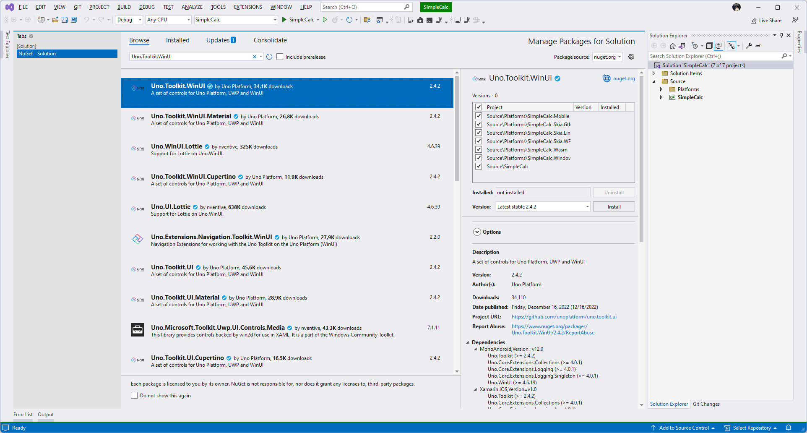
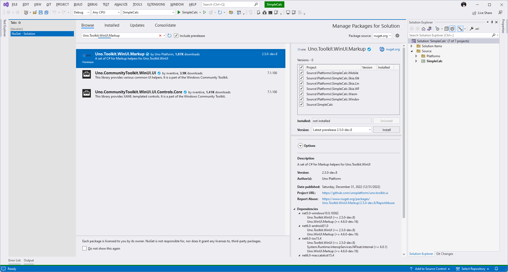

# Uno Toolkit

The Uno Toolkit provides a number of controls and attached properties that help us build pixel perfect apps. For the purposes of the Simple Calc we will be looking at 2 primary things from the Toolkit. For more information on the Toolkit be sure to check out the [Toolkit docs](https://platform.uno/docs/articles/external/uno.toolkit.ui/doc/getting-started.html)

## Installing the Toolkit

From Visual Studio or Visual Studio for Mac open the Package Manager and locate the package listed for either XAML or C# Markup. For those developing from Visual Studio Code please click on the link for the package to determine the latest available package and add the PackageReference to the SimpleCalc.csproj

<details>
<summary>XAML</summary>

Install [Uno.Toolkit.WinUI](https://www.nuget.org/packages/Uno.Toolkit.WinUI/)

<picture>
  <source media="(prefers-color-scheme: dark)" srcset="../../art/Dark/UnoToolkitWinUI.png">
  <source media="(prefers-color-scheme: light)" srcset="../../art/Light/UnoToolkitWinUI.png">
  
</picture>

Next open the App.xaml in the IDE and add the ToolkitResources as shown below to the Merged Dictionaries

```xml
<Application x:Class="UnoExtApp120.App"
			 xmlns="http://schemas.microsoft.com/winfx/2006/xaml/presentation"
			 xmlns:x="http://schemas.microsoft.com/winfx/2006/xaml"
			 xmlns:wasm="http://platform.uno/wasm"
			 xmlns:local="using:UnoExtApp120"
			 xmlns:mc="http://schemas.openxmlformats.org/markup-compatibility/2006"
			 mc:Ignorable="wasm">

	<Application.Resources>
		<ResourceDictionary>
			<ResourceDictionary.MergedDictionaries>
				<!-- Load WinUI resources -->
				<XamlControlsResources xmlns="using:Microsoft.UI.Xaml.Controls" />

				<!-- Load Uno Toolkit resources -->
				<ToolkitResources xmlns="using:Uno.Toolkit.UI" />
			</ResourceDictionary.MergedDictionaries>
			<!-- Add resources here -->
		</ResourceDictionary>
	</Application.Resources>

</Application>
```

</details>

<details>
<summary>C# Markup</summary>

Install [Uno.Toolkit.WinUI.Markup](https://www.nuget.org/packages/Uno.Toolkit.WinUI.Markup)

<picture>
  <source media="(prefers-color-scheme: dark)" srcset="../../art/Dark/UnoToolkitWinUIMarkup.png">
  <source media="(prefers-color-scheme: light)" srcset="../../art/Light/UnoToolkitWinUIMarkup.png">
  
</picture>

Next open the App.xaml.cs in the IDE and add the ToolkitResources as shown below to the Merged Dictionaries. Note that the XamlControlsResources have already been added you simply need to update the method to include the ToolkitResources.

```cs
public partial class App : Application
{
    protected override void OnLaunched(LaunchActivatedEventArgs args)
    {
        // boilerplate code

        this.Resources(r => r.Merged(
            new XamlControlsResources(),
            new ToolkitResources()));

        // boilerplate code
    }
}
```

</details>

## AutoLayout

For developers coming from other platforms it is easiest to think of the AutoLayout like a Flex Layout that you may be familiar with in web development or other UI Frameworks. For more information about the AutoLayout be sure to check out the [docs](https://platform.uno/docs/articles/external/uno.toolkit.ui/doc/controls/AutoLayoutControl.html).

For our layout we will start by adding an AutoLayout as the root which will contain our UI. Next we will add a ToggleButton centered at the top of our layout and two more AutoLayouts which we will later update to contain the Display and the Buttons for our Calculator.

<details>
<summary>XAML</summary>

```xml
<Page x:Class="SimpleCalculator.MainPage"
      xmlns="http://schemas.microsoft.com/winfx/2006/xaml/presentation"
      xmlns:x="http://schemas.microsoft.com/winfx/2006/xaml"
      xmlns:utu="using:Uno.Toolkit.UI">
  <Page.Resources>
    <x:String x:Key="SunIcon">F1 M 5.760000228881836 4.289999961853027 L 3.9600000381469727 2.5 L 2.549999952316284 3.9100000858306885 L 4.340000152587891 5.699999809265137 L 5.760000228881836 4.289999961853027 Z M 3 9.949999809265137 L 0 9.949999809265137 L 0 11.949999809265137 L 3 11.949999809265137 L 3 9.949999809265137 Z M 12 0 L 10 0 L 10 2.950000047683716 L 12 2.950000047683716 L 12 0 L 12 0 Z M 19.450000762939453 3.9100000858306885 L 18.040000915527344 2.5 L 16.25 4.289999961853027 L 17.65999984741211 5.699999809265137 L 19.450000762939453 3.9100000858306885 Z M 16.239999771118164 17.610000610351562 L 18.030000686645508 19.40999984741211 L 19.440000534057617 18 L 17.639999389648438 16.21000099182129 L 16.239999771118164 17.610000610351562 Z M 19 9.949999809265137 L 19 11.949999809265137 L 22 11.949999809265137 L 22 9.949999809265137 L 19 9.949999809265137 Z M 11 4.949999809265137 C 7.690000057220459 4.949999809265137 5 7.639999866485596 5 10.949999809265137 C 5 14.259999752044678 7.690000057220459 16.950000762939453 11 16.950000762939453 C 14.309999942779541 16.950000762939453 17 14.259999752044678 17 10.949999809265137 C 17 7.639999866485596 14.309999942779541 4.949999809265137 11 4.949999809265137 Z M 10 21.900001525878906 L 12 21.900001525878906 L 12 18.950000762939453 L 10 18.950000762939453 L 10 21.900001525878906 Z M 2.549999952316284 17.990001678466797 L 3.9600000381469727 19.400001525878906 L 5.75 17.600000381469727 L 4.340000152587891 16.190000534057617 L 2.549999952316284 17.990001678466797 Z</x:String>
  </Page.Resources>
  <utu:AutoLayout MaxWidth="700"
                  Padding="0,0,0,16"
                  PrimaryAxisAlignment="End">
    <ToggleButton Margin="8"
                  utu:AutoLayout.CounterAlignment="Center"
                  CornerRadius="20">
      <ToggleButton.Content>
        <PathIcon Data="{StaticResource SunIcon}" />
      </ToggleButton.Content>
    </ToggleButton>
    <utu:AutoLayout Spacing="16" Padding="16,8" PrimaryAxisAlignment="End" utu:AutoLayout.PrimaryAlignment="Stretch">
        <TextBlock Text="Equation"
                   utu:AutoLayout.CounterAlignment="End" />
        <TextBlock Text="Output"
                   utu:AutoLayout.CounterAlignment="End" />
    </utu:AutoLayout>
    <utu:AutoLayout MaxHeight="500" Spacing="16" Padding="16,0">
      <TextBox Text="Some Text"
               utu:AutoLayout.CounterAlignment="Stretch"/>
      <Button Content="Press Me"
              utu:AutoLayout.CounterAlignment="Stretch" />
    </utu:AutoLayout>
  </utu:AutoLayout>
</Page>
```

</details>

<details>
<summary>C# Markup</summary>

To keep things clean we'll start by adding an `AppResources` class that will contain a strongly typed reference for our Static Resources:

```cs
public static class AppResources
{
    public static class Icon
    {
        public static readonly Resource<Geometry> Sun =
            StaticResource.Create<Geometry>("SunIcon", "F1 M 5.760000228881836 4.289999961853027 L 3.9600000381469727 2.5 L 2.549999952316284 3.9100000858306885 L 4.340000152587891 5.699999809265137 L 5.760000228881836 4.289999961853027 Z M 3 9.949999809265137 L 0 9.949999809265137 L 0 11.949999809265137 L 3 11.949999809265137 L 3 9.949999809265137 Z M 12 0 L 10 0 L 10 2.950000047683716 L 12 2.950000047683716 L 12 0 L 12 0 Z M 19.450000762939453 3.9100000858306885 L 18.040000915527344 2.5 L 16.25 4.289999961853027 L 17.65999984741211 5.699999809265137 L 19.450000762939453 3.9100000858306885 Z M 16.239999771118164 17.610000610351562 L 18.030000686645508 19.40999984741211 L 19.440000534057617 18 L 17.639999389648438 16.21000099182129 L 16.239999771118164 17.610000610351562 Z M 19 9.949999809265137 L 19 11.949999809265137 L 22 11.949999809265137 L 22 9.949999809265137 L 19 9.949999809265137 Z M 11 4.949999809265137 C 7.690000057220459 4.949999809265137 5 7.639999866485596 5 10.949999809265137 C 5 14.259999752044678 7.690000057220459 16.950000762939453 11 16.950000762939453 C 14.309999942779541 16.950000762939453 17 14.259999752044678 17 10.949999809265137 C 17 7.639999866485596 14.309999942779541 4.949999809265137 11 4.949999809265137 Z M 10 21.900001525878906 L 12 21.900001525878906 L 12 18.950000762939453 L 10 18.950000762939453 L 10 21.900001525878906 Z M 2.549999952316284 17.990001678466797 L 3.9600000381469727 19.400001525878906 L 5.75 17.600000381469727 L 4.340000152587891 16.190000534057617 L 2.549999952316284 17.990001678466797 Z");
    }
}
```

Now that we have our resources defined in a clean easy way to reuse we can create the layout for our MainPage.

```cs
public partial class MainPage : Page
{
    public MainPage()
    {
        this.Resources(r => r.Add(AppResources.Icon.Sun))
            .Content(new AutoLayout()
            .MaxWidth(700)
            .Padding(0, 0, 0, 16)
            .PrimaryAxisAlignment(AutoLayoutAlignment.End)
            .Children(
                new ToggleButton()
                    .Margin(8)
                    .AutoLayout(counterAlignment: AutoLayoutAlignment.Center)
                    .CornerRadius(20)
                    .Content(new PathIcon().Data(AppResources.Icon.Sun)),
                new AutoLayout()
                    .Spacing(16)
                    .Padding(16,8)
                    .PrimaryAxisAlignment(AutoLayoutAlignment.End)
                    .AutoLayout(primaryAlignment: AutoLayoutPrimaryAlignment.Stretch)
                    .Children(
                        new TextBlock().Text("Equation").AutoLayout(counterAlignment: AutoLayoutAlignment.End),
                        new TextBlock().Text("Output").AutoLayout(counterAlignment: AutoLayoutAlignment.End)
                    ),
                new AutoLayout()
                    .MaxHeight(500)
                    .Spacing(16)
                    .Padding(16,0)
                    .Children(
                        new TextBox().Text("Some Text").AutoLayout(counterAlignment: AutoLayoutAlignment.Stretch),
                        new Button().Content("Press Me").AutoLayout(counterAlignment: AutoLayoutAlignment.Stretch)
                    )
            ));
    }
}
```

</details>

Now that you have basic Layout, run the app and take a look at how it looks. Depending on whether you are on PC or Mac try out some of the various targets available to you.

## Safe Area

Safe Area is a concept that is used to ensure that the UI is not covered by the device's status bar or navigation bar (or notch). For more information about the SafeArea be sure to check out the [docs](https://platform.uno/docs/articles/external/uno.toolkit.ui/doc/controls/SafeArea.html).

In order to make use of the SafeArea we need to update the root AutoLayout by using the `Insets` attached property set to `VisibleBounds`

<details>
<summary>XAML</summary>

```xml
<Page x:Class="SimpleCalculator.MainPage"
      xmlns="http://schemas.microsoft.com/winfx/2006/xaml/presentation"
      xmlns:x="http://schemas.microsoft.com/winfx/2006/xaml"
      xmlns:utu="using:Uno.Toolkit.UI">
  <utu:AutoLayout utu:SafeArea.Insets="VisibleBounds"
                  MaxWidth="700"
                  Padding="0,0,0,16"
                  PrimaryAxisAlignment="End">
    <!-- Your Content -->
  </utu:AutoLayout>
</Page>
```

</details>

<details>
<summary>C# Markup</summary>

```cs
public partial class MainPage : Page
{
    public MainPage()
    {
        this.Resources(r => r.Add(AppResources.Icon.Wb_Sunny))
            .Content(new AutoLayout()
            .SafeArea(SafeArea.InsetMask.VisibleBounds)
            .MaxWidth(700)
            .Padding(0, 0, 0, 16)
            .PrimaryAxisAlignment(AutoLayoutAlignment.End)
            .Children(
                // Your Content
            )
        );
    }
}
```

</details>

## Next Steps

- [04 - Themes](../04-Themes/README.md)