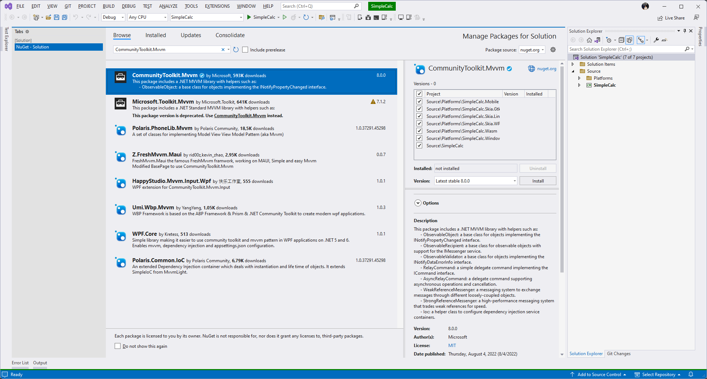

# Model View ViewModel (MVVM)

Model-View-ViewModel is a well established pattern for building applications. It is a pattern that is well suited to the Uno Platform, and is a great way to build your apps. In this module we will be looking at how to use the MVVM pattern to build our UI. We will be using the CommunityToolkit.MVVM to help us build our UI. It is important to note that while we will be using the CommunityToolkit that there are a number of other MVVM Frameworks that you can use with Uno Platform.

To start we need to install the CommunityToolkit.Mvvm NuGet package.

<picture>
  <source media="(prefers-color-scheme: dark)" srcset="../../art/Dark/CommunityToolkitMvvm.png">
  <source media="(prefers-color-scheme: light)" srcset="../../art/Light/CommunityToolkitMvvm.png">
  
</picture>

## Getting Started

To start off we will need to create a new model called `MainViewModel` and add a couple of properties to it. We'll add two properties that we will then bind to in our View. For our IsDark property we will need some special logic when IsDark is changed, for this property we will need to fully implement it. However for our Output property we can simply provide the private backing field and let the source generator generate the boilerplate for the public facing property by marking the private field with the `[ObservableProperty]` attribute.

```cs
public partial class MainViewModel : ObservableObject
{
    private bool _isDark = AppThemeService.Instance.IsDark;
    public bool IsDark
    {
        get => _isDark;
        set => SetProperty(ref _isDark, value, dark => { AppThemeService.Instance.SetThemeAsync(dark, default); });
    }

    [ObservableProperty]
    private string _output = string.Empty;
}
```

## Binding to properties in the UI

With our ViewModel created we will now need to set up our DataContext and create some bindings.

<details>
<summary>XAML</summary>

To start let's set the DataContext in the MainPage.xaml.cs (code behind).

```cs
public partial class MainPage : Page
{
    public MainPage()
    {
        InitializeComponent();
        DataContext = new MainViewModel();
    }
}
```

Now let's update our UI in the MainPage.xaml to use the bindings.

```xml
<Page x:Class="SimpleCalculator.MainPage"
      xmlns="http://schemas.microsoft.com/winfx/2006/xaml/presentation"
      xmlns:x="http://schemas.microsoft.com/winfx/2006/xaml"
      xmlns:utu="using:Uno.Toolkit.UI"
      xmlns:um="using:Uno.Material"
      Background="{ThemeResource BackgroundBrush}">
  <!-- Page Resources excluded for clarity -->
  <utu:AutoLayout utu:SafeArea.Insets="VisibleBounds"
                  MaxWidth="700"
                  Padding="0,0,0,16"
                  Background="{ThemeResource BackgroundBrush}"
                  PrimaryAxisAlignment="End">
    <ToggleButton Background="{ThemeResource SecondaryContainerBrush}"
                  Margin="8"
                  utu:AutoLayout.CounterAlignment="Center"
                  Style="{StaticResource IconToggleButtonStyle}"
                  IsChecked="{Binding IsDark, Mode=TwoWay}"
                  CornerRadius="20">
      <ToggleButton.Content>
        <PathIcon Data="{StaticResource SunIcon}"
                  Foreground="{ThemeResource PrimaryVariantDarkBrush}" />
      </ToggleButton.Content>
      <um:ControlExtensions.AlternateContent>
        <PathIcon Data="{StaticResource MoonIcon}"
                  Foreground="{ThemeResource PrimaryVariantDarkBrush}" />
      </um:ControlExtensions.AlternateContent>
    </ToggleButton>
    <utu:AutoLayout Spacing="16"
                    Padding="16,8"
                    PrimaryAxisAlignment="End"
                    utu:AutoLayout.PrimaryAlignment="Stretch">
        <TextBlock Text="Equation"
                   utu:AutoLayout.CounterAlignment="End"
                   Foreground="{ThemeResource OnSecondaryContainerBrush}"
                   Style="{StaticResource DisplaySmall}" />
        <TextBlock Text="{Binding Output}"
                   utu:AutoLayout.CounterAlignment="End" Foreground="{ThemeResource OnBackgroundBrush}" Style="{StaticResource DisplayLarge}" />
    </utu:AutoLayout>
    <utu:AutoLayout MaxHeight="500" Spacing="16" Padding="16,0">
      <TextBox Text="{Binding Output}"
               utu:AutoLayout.CounterAlignment="Stretch"/>
      <Button Content="Press Me"
              utu:AutoLayout.CounterAlignment="Stretch" />
    </utu:AutoLayout>
  </utu:AutoLayout>
</Page>
```

With our bindings in place we can now run the app and see the theme switch work.
</details>

<details>
<summary>C# Markup</summary>

To start we need to set the DataContext, but we will want to make a change to the way that we initialize the UI so that we can create strongly typed bindings. Using the DataContext extension we can pass in a new instance of the `MainViewModel` to set the DataContext and then we can provide a delegate with the Page and the provided DataContext type to use as we configure the Page content and configure bindings.

```cs
public MainPage()
{
    this.DataContext(new MainViewModel(), (page, dataContext) => page
      .Content(...));
}
```

> **NOTE:** Binding expressions must be stateless and the model property in our lambda expression will *ALWAYS* have a null value. Attempting to access instance values from the model will result in a NullReferenceException.

Now we need to create the bindings.

```cs
public MainPage()
{
    this.DataContext(new MainViewModel(), (page, dataContext) => page
        .Resources(r => r
            .Add(AppResources.Icon.Sun)
            .Add(AppResources.Icon.Moon))
        .Background(Theme.Brushes.Background.Default)
        .Content(new AutoLayout()
        .MaxWidth(700)
        .Padding(0, 0, 0, 16)
        .PrimaryAxisAlignment(AutoLayoutAlignment.End)
        .Children(
            new ToggleButton()
                .Margin(8)
                .CornerRadius(20)
                .AutoLayout(counterAlignment: AutoLayoutAlignment.Center)
                .Background(Theme.Brushes.Secondary.Container.Default)
                .Style(Theme.Styles.ToggleButton.Icon)
                .IsChecked(() => dataContext.IsDark) // Binding Expression
                .Content(new PathIcon()
                    .Data(AppResources.Icon.Sun))
                .ControlExtensions(alternateContent: new PathIcon()
                    .Data(AppResources.Icon.Moon)
                    .Foreground(Theme.Brushes.Primary.VariantDark.Default)),
            new AutoLayout()
                .Spacing(16)
                .Padding(16,8)
                .PrimaryAxisAlignment(AutoLayoutAlignment.End)
                .AutoLayout(primaryAlignment: AutoLayoutPrimaryAlignment.Stretch)
                .Children(
                    new TextBlock()
                        .Text("Equation")
                        .AutoLayout(counterAlignment: AutoLayoutAlignment.End)
                        .Foreground(Theme.Brushes.OnSecondary.Container.Default)
                        .Style(Theme.Styles.TextBlock.DisplaySmall),
                    new TextBlock()
                        .Text(() => dataContext.Output) // Binding Expression
                        .AutoLayout(counterAlignment: AutoLayoutAlignment.End)
                        .Foreground(Theme.Brushes.OnBackground.Default)
                        .Style(Theme.Styles.TextBlock.DisplayLarge)
                ),
            new AutoLayout()
                .MaxHeight(500)
                .Spacing(16)
                .Padding(16,0)
                .Children(
                    new TextBox()
                        .Text(() => dataContext.Output) // Binding Expression
                        .AutoLayout(counterAlignment: AutoLayoutAlignment.Stretch),
                    new Button()
                        .Content("Press Me")
                        .AutoLayout(counterAlignment: AutoLayoutAlignment.Stretch)
                )
        )));
}
```

With our bindings in place we can now run the app and see the theme switch work.
</details>

## Commands

In addition to properties, sometimes we may need to create and execute commands. For this we will add a couple of properties to our `MainViewModel` and then update the `Button` in our UI to use the `Command` property.

```cs
public partial class MainViewModel : ObservableObject
{
    // Other properties left out for simplification
    [ObservableProperty]
    private string _content = "Press Me";
    private int _count;

    [RelayCommand]
    private void PressMe() =>
        Content = ++_count switch
        {
            1 => "Pressed Once",
            _ => $"Pressed {_count} Times"
        };
}
```

<details>
<summary>XAML</summary>

Now we just need to update the Button in our UI as shown here.

```xml
<Button Content="{Binding Content}"
        Command="{Binding PressMeCommand}"
        utu:AutoLayout.CounterAlignment="Stretch" />
```
</details>

<details>
<summary>C# Markup</summary>

Now we just need to update the Button in our UI as shown here.

```cs
new Button()
    .Content(() => dataContext.Content)
    .Command(() => dataContext.PressMeCommand)
    .AutoLayout(counterAlignment: AutoLayoutAlignment.Stretch)
```
</details>

With our UI updated we can run the app again and Press the Button. We should see the text of the Button change to reflect the number of times it has been pressed.
