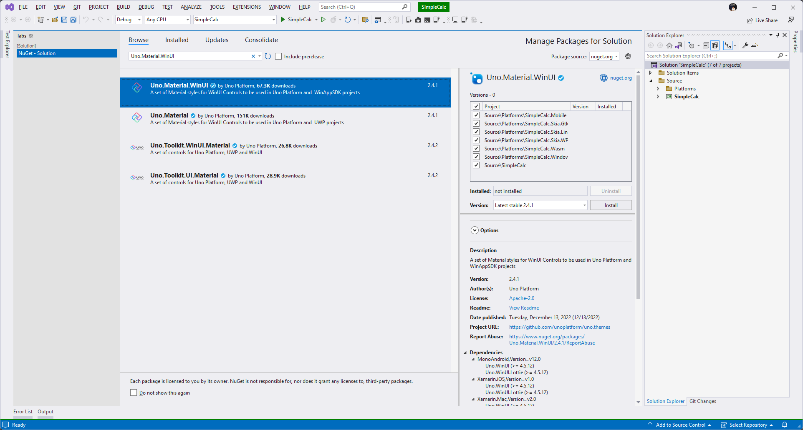
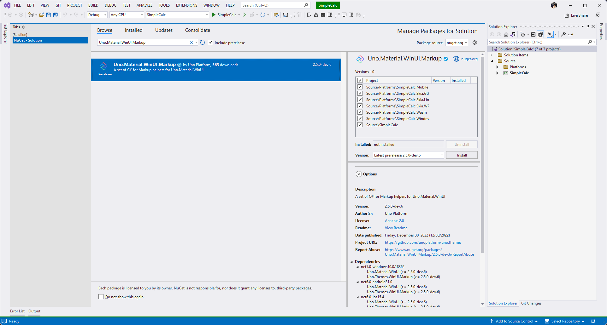

# Themes

As we begin to look at themes we will look at two different and equally important parts to a Theme. The first thing we will look at is the App Theme as we toggle between Light and Dark Mode. Next we will look at common design systems such as the default Fluent design system provided out of the box with Uno Platform and WinUI, followed by the more commonly used Material design system with Uno Platform.

## App Theme

To start you will need to install the `Uno.Workshops.SimpleCalc` nuget package. This will bring in some resources for you including the calculator engine.

Now we need to initialize the AppThemeService. We can do this by going to our App.xaml.cs and finding where we set the local variable for the application Window. We can then update like shown below.

> **NOTE:** The App.xaml.cs can be found in any of our platform heads. This file is linked from a common location and will only need to be updated once as it will update all of the platforms when updated.

```cs
public partial class App : Application
{
    protected override void OnLaunched(LaunchActivatedEventArgs args)
    {
#if NET6_0_OR_GREATER && WINDOWS && !HAS_UNO
        _window = new Window();
        _window.Activate();
#else
        _window = Microsoft.UI.Xaml.Window.Current;
#endif
        AppThemeService.Init(_window);
    }
}
```

With the AppThemeService initialized now we need to hook up the ToggleButton from the previous module with a temporary event handler which we will use to update the App's Theme from Light to Dark. To do this go to the MainPage.xaml.cs if you're using XAML or just MainPage.cs if you're using C# Markup add the following event handler:

```cs
private static void OnCheckedChanged(object? sender, RoutedEventArgs e)
{
    if(sender is not ToggleButton toggle)
        return;
    AppThemeService.Instance.SetThemeAsync(toggle.IsChecked, default);
}
```

Now we need to update the ToggleButton to invoke our `OnCheckedChanged` event handler and make sure that the ToggleButton IsChecked is set to true if your current theme is Dark Mode.

<details>
<summary>XAML</summary>

Open the MainPage.xaml. To add the event handler we will need to add the `Checked="OnCheckedChanged"` to our ToggleButton as shown below. We also will want to give our ToggleButton a name so that we can reference it from the code behind to set the initial value of checked.

```xml
<ToggleButton Margin="8"
              utu:AutoLayout.CounterAlignment="Center"
              CornerRadius="20"
              Checked="OnCheckedChanged"
              x:Name="toggle">
  <ToggleButton.Content>
    <PathIcon Data="{StaticResource SunIcon}" />
  </ToggleButton.Content>
</ToggleButton>
```

With our XAML updated now we need to edit the code behind in MainPage.xaml.cs. We will need to add the following code to the constructor of the MainPage class.

```cs
public partial class MainPage : Page
{
    public MainPage()
    {
        InitializeComponent();
        toggle.IsChecked = AppThemeService.Instance.IsDark;
    }
}
```

> **NOTE:** We must set the IsChecked property after we invoke `InitializeComponent()` as this is where the ToggleButton is created.

With these changes now we can run the app again and toggle the ToggleButton to see the app change between Light and Dark Mode.
</details>

<details>
<summary>C# Markup</summary>

```cs
public partial class MainPage : Page
{
    public MainPage()
    {
        this.Resources(r => r.Add(AppResources.Icon.Sun))
            .Content(new AutoLayout()
            .MaxWidth(700)
            .Padding(0, 0, 0, 16)
            .PrimaryAxisAlignment(AutoLayoutAlignment.End)
            .Children(
                new ToggleButton()
                    .Margin(8)
                    .AutoLayout(counterAlignment: AutoLayoutAlignment.Center)
                    .CornerRadius(20)
                    .Content(new PathIcon().Data(AppResources.Icon.Sun))
                    .IsChecked(AppThemeService.Instance.IsDark)
                    .Assign(out var toggle),
                // Additional Content excluded for clarity
            ));

        toggle.Checked += OnCheckedChanged;
    }

    private static void OnCheckedChanged(object? sender, RoutedEventArgs e)
    {
        if(sender is not ToggleButton toggle)
            return;
        AppThemeService.Instance.SetThemeAsync(toggle.IsChecked, default);
    }
}
```

With these changes now we can run the app again and toggle the ToggleButton to see the app change between Light and Dark Mode.
</details>

## Material Design System

Material Design was first introduced by Google in 2014 and has since become a widely adopted standard by designers across application ecosystems. When building applications with Uno Platform you can easily use the Material Design System by installing the Uno.Material.WinUI nuget package. This package will bring in all of the resources you need to use Material Design in your application.

> **NOTE:** While the Simple Calc does not make use of visual controls from the Uno Toolkit such as the NavigationBar or TabBar, some Uno libraries such as the Toolkit additionally ship support packages for Material which provide the additional style Resource Dictionaries that are needed to provide a material look and feel.

<details>
<summary>XAML</summary>

Install Uno.Material.WinUI

<picture>
  <source media="(prefers-color-scheme: dark)" srcset="../../art/Dark/UnoMaterialWinUI.png">
  <source media="(prefers-color-scheme: light)" srcset="../../art/Light/UnoMaterialWinUI.png">
  
</picture>

With Uno Material installed navigate to the App.xaml in any of the Platform heads and add the Material Resource Dictionaries to the MergedDictionaries collection.

```xml
<Application.Resources>
  <ResourceDictionary>
    <ResourceDictionary.MergedDictionaries>
      <!-- Load WinUI resources -->
      <XamlControlsResources xmlns="using:Microsoft.UI.Xaml.Controls" />

      <!-- Load Uno Toolkit resources -->
      <ToolkitResources xmlns="using:Uno.Toolkit.UI" />

      <!-- Load Uno Material resources -->
      <MaterialColors xmlns="using:Uno.Material" />
      <MaterialFonts xmlns="using:Uno.Material" />
      <MaterialResources xmlns="using:Uno.Material" />
    </ResourceDictionary.MergedDictionaries>
    <!-- Add resources here -->
  </ResourceDictionary>
</Application.Resources>
```

With these changes now we can run the app again and see the default theme.

Now let's make an update to our Toggle Button so that we have a different icon between Light and Dark theme and add some styles as shown below

```xml
<Page x:Class="SimpleCalculator.MainPage"
      xmlns="http://schemas.microsoft.com/winfx/2006/xaml/presentation"
      xmlns:x="http://schemas.microsoft.com/winfx/2006/xaml"
      xmlns:utu="using:Uno.Toolkit.UI"
      xmlns:um="using:Uno.Material"
      Background="{ThemeResource BackgroundBrush}">
  <Page.Resources>
    <Page.Resources>
        <x:String x:Key="MoonIcon">F1 M 3 0 C 1.9500000476837158 0 0.949999988079071 0.1600000262260437 0 0.46000003814697266 C 4.059999942779541 1.7300000190734863 7 5.519999980926514 7 10 C 7 14.480000019073486 4.059999942779541 18.27000093460083 0 19.540000915527344 C 0.949999988079071 19.840000927448273 1.9500000476837158 20 3 20 C 8.519999980926514 20 13 15.519999980926514 13 10 C 13 4.480000019073486 8.519999980926514 0 3 0 Z</x:String>
        <x:String x:Key="SunIcon">F1 M 5.760000228881836 4.289999961853027 L 3.9600000381469727 2.5 L 2.549999952316284 3.9100000858306885 L 4.340000152587891 5.699999809265137 L 5.760000228881836 4.289999961853027 Z M 3 9.949999809265137 L 0 9.949999809265137 L 0 11.949999809265137 L 3 11.949999809265137 L 3 9.949999809265137 Z M 12 0 L 10 0 L 10 2.950000047683716 L 12 2.950000047683716 L 12 0 L 12 0 Z M 19.450000762939453 3.9100000858306885 L 18.040000915527344 2.5 L 16.25 4.289999961853027 L 17.65999984741211 5.699999809265137 L 19.450000762939453 3.9100000858306885 Z M 16.239999771118164 17.610000610351562 L 18.030000686645508 19.40999984741211 L 19.440000534057617 18 L 17.639999389648438 16.21000099182129 L 16.239999771118164 17.610000610351562 Z M 19 9.949999809265137 L 19 11.949999809265137 L 22 11.949999809265137 L 22 9.949999809265137 L 19 9.949999809265137 Z M 11 4.949999809265137 C 7.690000057220459 4.949999809265137 5 7.639999866485596 5 10.949999809265137 C 5 14.259999752044678 7.690000057220459 16.950000762939453 11 16.950000762939453 C 14.309999942779541 16.950000762939453 17 14.259999752044678 17 10.949999809265137 C 17 7.639999866485596 14.309999942779541 4.949999809265137 11 4.949999809265137 Z M 10 21.900001525878906 L 12 21.900001525878906 L 12 18.950000762939453 L 10 18.950000762939453 L 10 21.900001525878906 Z M 2.549999952316284 17.990001678466797 L 3.9600000381469727 19.400001525878906 L 5.75 17.600000381469727 L 4.340000152587891 16.190000534057617 L 2.549999952316284 17.990001678466797 Z</x:String>
    </Page.Resources>
  </Page.Resources>
  <utu:AutoLayout utu:SafeArea.Insets="VisibleBounds"
                  MaxWidth="700"
                  Padding="0,0,0,16"
                  Background="{ThemeResource BackgroundBrush}"
                  PrimaryAxisAlignment="End">
    <ToggleButton Background="{ThemeResource SecondaryContainerBrush}"
                  Margin="8"
                  utu:AutoLayout.CounterAlignment="Center"
                  Style="{StaticResource IconToggleButtonStyle}"
                  CornerRadius="20"
                  Checked="OnCheckedChanged"
                  x:Name="toggle">
      <ToggleButton.Content>
        <PathIcon Data="{StaticResource SunIcon}"
                  Foreground="{ThemeResource PrimaryVariantDarkBrush}" />
      </ToggleButton.Content>
      <um:ControlExtensions.AlternateContent>
        <PathIcon Data="{StaticResource MoonIcon}"
                  Foreground="{ThemeResource PrimaryVariantDarkBrush}" />
      </um:ControlExtensions.AlternateContent>
    </ToggleButton>
    <utu:AutoLayout Spacing="16"
                    Padding="16,8"
                    PrimaryAxisAlignment="End"
                    utu:AutoLayout.PrimaryAlignment="Stretch">
        <TextBlock Text="Equation"
                   utu:AutoLayout.CounterAlignment="End"
                   Foreground="{ThemeResource OnSecondaryContainerBrush}"
                   Style="{StaticResource DisplaySmall}" />
        <TextBlock Text="Output"
                   utu:AutoLayout.CounterAlignment="End" Foreground="{ThemeResource OnBackgroundBrush}" Style="{StaticResource DisplayLarge}" />
    </utu:AutoLayout>
    <utu:AutoLayout MaxHeight="500" Spacing="16" Padding="16,0">
      <TextBox Text="Some Text"
               utu:AutoLayout.CounterAlignment="Stretch"/>
      <Button Content="Press Me"
              utu:AutoLayout.CounterAlignment="Stretch" />
    </utu:AutoLayout>
  </utu:AutoLayout>
</Page>
```

Now with the additional styles be sure to run the app again and take note of the updated look and feel.

</details>

<details>
<summary>C# Markup</summary>

Install Uno.Material.WinUI.Markup

<picture>
  <source media="(prefers-color-scheme: dark)" srcset="../../art/Dark/UnoMaterialWinUIMarkup.png">
  <source media="(prefers-color-scheme: light)" srcset="../../art/Light/UnoMaterialWinUIMarkup.png">
  
</picture>

With Uno Material installed navigate to the App.xaml.cs in any of the Platform heads and add the Material Resource Dictionaries to the MergedDictionaries collection.

```cs
public partial class App : Application
{
    protected override void OnLaunched(LaunchActivatedEventArgs args)
    {
        // boilerplate code

        this.Resources(r => r.Merged(
            new XamlControlsResources(),
            new ToolkitResources()));
        this.UseMaterial();

        // boilerplate code
    }
}
```

With these changes now we can run the app again and see the default theme.

Now let's make an update to our Toggle Button so that we have a different icon between Light and Dark theme. First we'll need to add a new Icon to our AppResources class.

```cs
public static class AppResources
{
    public static class Icon
    {
        public static readonly Resource<Geometry> Sun =
            StaticResource.Create<Geometry>("SunIcon", "... path excluded for brevity ....");

        public static readonly Resource<Geometry> Moon =
            StaticResource.Create<Geometry>("MoonIcon", "F1 M 3 0 C 1.9500000476837158 0 0.949999988079071 0.1600000262260437 0 0.46000003814697266 C 4.059999942779541 1.7300000190734863 7 5.519999980926514 7 10 C 7 14.480000019073486 4.059999942779541 18.27000093460083 0 19.540000915527344 C 0.949999988079071 19.840000927448273 1.9500000476837158 20 3 20 C 8.519999980926514 20 13 15.519999980926514 13 10 C 13 4.480000019073486 8.519999980926514 0 3 0 Z");
    }
}
```

With our updated Moon icon we just need to update the ToggleButton and add some styles as shown below.

```cs
public partial class MainPage : Page
{
    public MainPage()
    {
        this.Resources(r => r
                .Add(AppResources.Icon.Sun)
                .Add(AppResources.Icon.Moon))
            .Background(Theme.Brushes.Background.Default)
            .Content(new AutoLayout()
            .MaxWidth(700)
            .Padding(0, 0, 0, 16)
            .PrimaryAxisAlignment(AutoLayoutAlignment.End)
            .Children(
                new ToggleButton()
                    .Margin(8)
                    .CornerRadius(20)
                    .AutoLayout(counterAlignment: AutoLayoutAlignment.Center)
                    .Background(Theme.Brushes.Secondary.Container.Default)
                    .Style(Theme.Styles.ToggleButton.Icon)
                    .IsChecked(AppThemeService.Instance.IsDark)
                    .Content(new PathIcon()
                        .Data(AppResources.Icon.Sun))
                    .ControlExtensions(alternateContent: new PathIcon()
                        .Data(AppResources.Icon.Moon)
                        .Foreground(Theme.Brushes.Primary.VariantDark.Default)),
                new AutoLayout()
                    .Spacing(16)
                    .Padding(16,8)
                    .PrimaryAxisAlignment(AutoLayoutAlignment.End)
                    .AutoLayout(primaryAlignment: AutoLayoutPrimaryAlignment.Stretch)
                    .Children(
                        new TextBlock()
                            .Text("Equation")
                            .AutoLayout(counterAlignment: AutoLayoutAlignment.End)
                            .Foreground(Theme.Brushes.OnSecondary.Container.Default)
                            .Style(Theme.Styles.TextBlock.DisplaySmall),
                        new TextBlock()
                            .Text("Output")
                            .AutoLayout(counterAlignment: AutoLayoutAlignment.End)
                            .Foreground(Theme.Brushes.OnBackground.Default)
                            .Style(Theme.Styles.TextBlock.DisplayLarge)
                    ),
                new AutoLayout()
                    .MaxHeight(500)
                    .Spacing(16)
                    .Padding(16,0)
                    .Children(
                        new TextBox().Text("Some Text").AutoLayout(counterAlignment: AutoLayoutAlignment.Stretch),
                        new Button().Content("Press Me").AutoLayout(counterAlignment: AutoLayoutAlignment.Stretch)
                    )
            ));
    }
}
```

Now with the additional styles be sure to run the app again and take note of the updated look and feel.

</details>

## Customizing the Color Palette

While out of the Box the Uno Material package will help you to deliver an app that looks great and follows the Material Design system, the simple reality is that you probably want to customize the colors to deliver an app matching your desired look and feel.

<details>
<summary>XAML</summary>

Open up the App.xaml in any of the Platform head projects.

```xml
<MaterialColors xmlns="using:Uno.Material"
                OverrideSource="ms-appx:///SimpleCalculator/Styles/ColorPaletteOverride.xaml" />
```

Now run the app and you'll notice how the colors have been updated
</details>

<details>
<summary>C# Markup</summary>

Open up the App.xaml.cs in any of the Platform head projects.

```cs
public partial class App : Application
{
    protected override void OnLaunched(LaunchActivatedEventArgs args)
    {
        // boilerplate code

        this.Resources(r => r.Merged(
            new XamlControlsResources(),
            new ToolkitResources()));
        this.UseMaterial(colorOverride: new Styles.ColorPaletteOverride());

        // boilerplate code
    }
}
```

Now run the app and you'll notice how the colors have been updated
</details>
